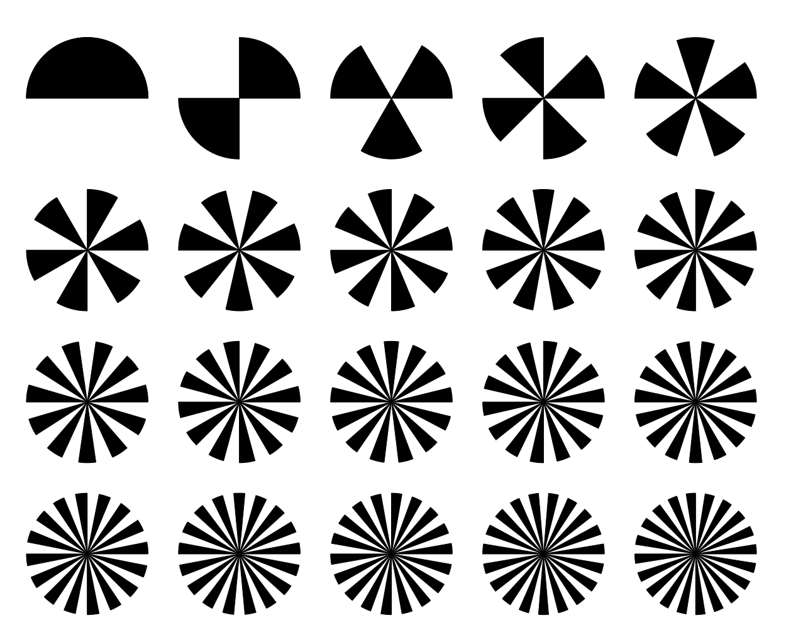

# N-fold-edge Marker locator and tracker

N-fold-edge is a marker locator and tracker. It can locate the following types of markers with high accuracy and speed.



## Table of contents:

- [Installation](#installation)
- [Usage](#usage)
- [Documentation](#documentation)
- [Contributing](#contributing)
- [License](#license)

## Installation

N-fold-edge is a python package and can be installed with pip, uv etc.

```
pip install CDC
```

For more advanced installation, please visit the [Documentation]() for more information.

## Usage

When install n-fold-edge can be used as cli. See [CLI]() for more information.

## Documentation

For a full list of command line arguments see [CLI](). For a reference manual, please visit [Reference Manual]()

## Contributing

For contribution guidelines, please see the [Documentation]().

## License

The software is licensed under the BSD-3-Clause license, see [License](LICENSE).
