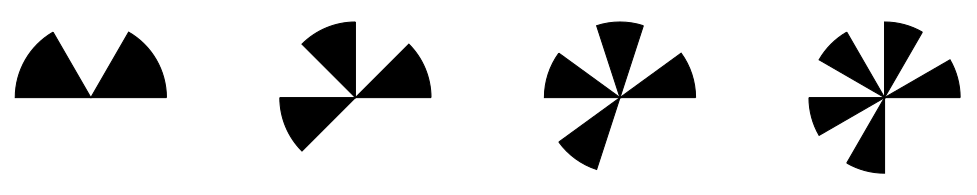

How the marker locator works
============================

Here is a description on how the marker is designed and how detecting it works.

Fourier transform
-----------------

Given :math:`N` observations (:math:`x_0`, :math:`x_1`, ...), the :math:`kth` term in the discrete Fourier transform is given by the equation:

.. math:: X_{k}=\sum _{n=0}^{N-1} x_{n} \cdot e^{-i2\pi kn/N}

Notice that the Discrete Fourier transform is a weighted sum over a set of observations, that is a convolution. In the standard situation the set of observations is sampled along a linear dimension.

Instead of sampling along a linear dimension, the sampling will be done over a 2D area, the kernel window. This is similar to a 2 D convolution, which is defined as follows:

.. math:: f[x, y] * g[x, y] = \sum_{k = -w}^{w} \sum_{l = -w}^{w} f[k, l] \cdot g(x - k, y - l)

The task is now to design a pattern to add to the object that should be tracked and which is possible to detect with the convolution based approach described above.

Square wave
-----------

A square wave :math:`x(t)` with amplitude :math:`1` and frequency :math:`f` can be represented with the Fourier series

.. math:: x(t)=\frac{4}{\pi} \left(\sin(2\pi ft)+\frac{1}{3} \sin(6 \pi f t) + \frac{1}{5} \sin(10 \pi f t) + \ldots \right)

Given the function :math:`x(t)`, the Fourier transform can be used to determine the elements of the Fourier series.

The plain marker
----------------

Instead of locating a square wave in an image, the pattern is bent around a certain point and then replaced with high and low intensities. This is illustrated in :numref:`fig-marker-bending`. The generated pattern has a well defined spatial center and as will be seen later, the pattern can be detected using convolution.

.. _fig-marker-bending:

.. list-table:: Four repetitions of a square wave pattern is bent into a circular pattern around a central point. The direction from the central point out to the low levels of the square wave is coloured black.
   :width: 100%
   :class: borderless

   * - .. figure:: ../_static/notes/marker_bending/markertrackerbendingstill1.png
          :width: 100%

     - .. figure:: ../_static/notes/marker_bending/markertrackerbendingstill61.png
          :width: 100%

     - .. figure:: ../_static/notes/marker_bending/markertrackerbendingstill121.png
          :width: 100%

     - .. figure:: ../_static/notes/marker_bending/markertrackerbendingstill181.png
          :width: 100%

     - .. figure:: ../_static/notes/marker_bending/markertrackerbendingstill241.png
          :width: 100%

     - .. figure:: ../_static/notes/marker_bending/markertrackerbendingstill300.png
          :width: 100%

     - .. figure:: ../_static/notes/marker_bending/finalmarker.png
          :width: 100%

By altering the number of repetitions of the black and white pattern around the central point, a set of different markers can be generated. The number of repetitions of the pattern is denoted the order ($n$) of the pattern. In :numref:`fig-plain-markers` 20 patterns are visualized, the patterns have the orders :math:`n = 1` to :math:`n = 20`.

.. _fig-plain-markers:

.. figure:: ../_static/markers.png

    Markers with different orders from 1 to 20.

Detection of marker
-------------------

Detection of a square wave with $n$ repetitions using Fourier analysis, relies on a convolution of the $N$ measurement of the signal with the kernel :math:`Y_n`:

.. math:: Y_n = e^{-i 2 \pi k n / N} \qquad k \in [0, \ldots, N - 1]

A somewhat similar kernel is used to detect the n-fold edge markers. The kernel is specified using polar coordinates as follows:

.. math:: Z_n = e^{-i n \theta} \cdot r^n \cdot e^{-8 r^2}

where :math:`\theta` is the direction and $r$ is the distance to the actual position in the kernel. The center of the polar coordinates are placed in the middle of the kernel and is scaled such that a circle with radius 1 is the largest circle that can be placed inside the kernel. Four different views of a kernel with order :math:`n = 4` is shown in
:numref:`fig-kernels`.

.. _fig-kernels:

.. list-table:: Different views of the complex kernel used for detecting n-fold markers (n = 4).
   :width: 100%
   :class: borderless

   * - .. figure:: ../_static/notes/pythonpic/kernel_real_part.png
          :width: 100%

          Real part of kernel.

     - .. figure:: ../_static/notes/pythonpic/kernel_imaginary_part.png
          :width: 100%

          Imaginary part of kernel.

   * - .. figure:: ../_static/notes/pythonpic/kernel_magnitude.png
          :width: 100%

          Magnitude of kernel.

     - .. figure:: ../_static/notes/pythonpic/kernel_argument.png
          :width: 100%

          Argument of kernel.

To detect a marker with a known order, the input image is converted to a grayscale image and then convolved with the :math:`Z_n` kernel. As the $Z_n$ kernel contains complex weights, the resulting image will contain complex values. The magnitude of the complex values in the resulting image, tells us how well the input picture matches the used kernel, this is visualized in :numref:`fig-detection-example`. The argument of the complex value tells the orientation of the pattern, to best match the input image.

.. _fig-detection-example:

.. list-table:: Marker detection example response.
   :width: 100%
   :class: borderless

   * - .. figure:: ../_static/notes/pythonpic/hubsanwithmarker_small.png
          :width: 100%

          Input image containing markers of order 4 and 5.

     - .. figure:: ../_static/notes/pythonpic/hubsan_magnitude_response_inverted_n4_kernel.png
          :width: 100%

          Marker detection response in inverted colors. Black denotes a high response to the marker.

Estimating the quality of the detected marker
---------------------------------------------

Interpreting the magnitude response to the :math:`Z_n` kernel poses an issue when markers with different (but nearby) orders are present in the input image. As can be seen in :numref:`fig-detection-example`, where a marker of order :math:`n = 4` is being detected, there is a moderate response around the marker mounted on the Hubsan UAV with order :math:`n = 5`. This issue can of course be reduced by avoiding markers with similar orders in the same image, but a better solution is to check that the algorithm actually found a marker with the requested order; that is to assign some kind of quality score of the detection result.

The used approach for estimating the quality of a detected marker, is to utilize information about the orientation of the marker (from the argument of the kernel response) to align the orientation of the located marker with the expected pattern of white and black regions. An example of a template for the position of white and black markers are shown in
:numref:`fig-quality-estimation`. For all pixels in the white / black regions of the template, the average image intensity and standard deviation is calculated, this gives the values: :math:`\mu_w`, :math:`\mu_b`, :math:`\sigma_w` and :math:`\sigma_b`.

.. _fig-quality-estimation:

.. list-table:: Visualization of how the quality of the detected marker in :numref:`fig-detection-example` is assessed. A region centered above the detected marker is extracted, the quality template divides the extracted part of the image into three regions: expected white pixels, expected black pixels and don't care pixels. The template is rotated so it is aligned with the detected marker.
   :width: 100%
   :class: borderless

   * - .. figure:: ../_static/notes/pythonpic/hubsan_region_around_detected_marker.png
          :width: 100%

     - .. figure:: ../_static/notes/pythonpic/hubsan_oriented_quality_template_oriented.png
          :width: 100%

     - .. figure:: ../_static/notes/pythonpic/hubsan_merged_input_and_oriented_quality_template_oriented.png
          :width: 100%

A marker that matches the pattern that has been searched for (regarding order of the kernel) and is positioned correctly above the center of the pattern, will have well separated grayscale values for pixels in the white and black regions respectively. Whether this is the case is quantified by calculating the normalized difference (:math:`t`) between the grayscale values in the white and black regions:

.. math:: t = \frac{\mu_w - \mu_b}{0.5 \cdot \sigma_w + 0.5 \cdot \sigma_b}

If :math:`t` has a value above 7, it indicates that there is a very large difference between the grayscale values in the white and black regions of the template. In an attempt of making the estimated quality easier to interpret, the following mapping between the :math:`t` value and the resulting quality score is utilized.

.. math:: \text{quality} = 1 - \frac{1}{1 + e^{0.75 \cdot (t - 7)}}

The quality score gives a number between zero and one. A low score indicates that the detected marker does not match what was searched for and is likely to be a random match. When the quality score gets above 0.5 the tracker is quite confident that the detected marker is actually what was searched for.

The oriented marker
-------------------

Even though the plain marker contains some information about the orientation of the marker (as it is possible to discriminate between markers with different orientations), is is not possible for the pattern to point in a certain direction, for eg. specifying the orientation of a tracked object. By changing one of the black legs of the pattern to white, the pattern is given a unique orientation. This is illustrated in :numref:`fig-markers-with.one-missing-black-element`.

.. _fig-markers-with.one-missing-black-element:

    Markers where one of the black legs have been removed to indicate an orientation of the marker. The markers have the orders (n = 3 ... 6).
