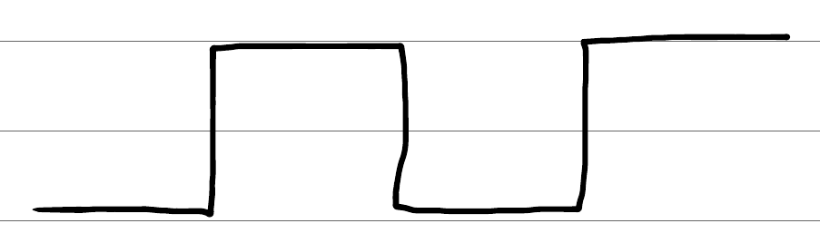
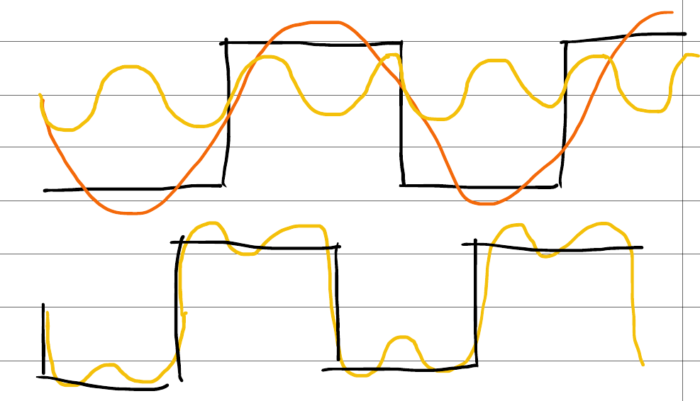
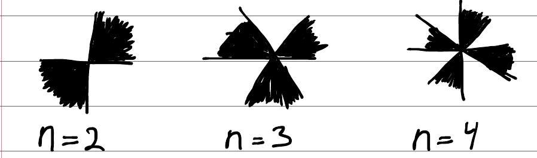
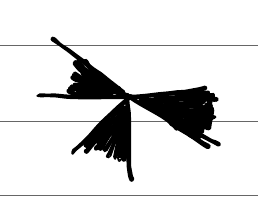

Quick marker explanation
========================

The system is based on the Fourier transform for detecting square waves (see :numref:`fig-squarewave`).
The square weave is observed when going around the center of the marker.

.. _fig-squarewave:

    Example square wave.

The square wave can be represented by a fourier series on the form.

.. math:: f\left( x\right) =\sum ^{\infty }_{k=1}\dfrac {\sin \left( kx\right) }{k}

When searching for the marker, only the two first terms in the Fourier expansion is taken into account.

.. math:: f\left( x\right) =\sin \left( x\right) +\dfrac {1}{3}\sin \left( 3x\right) +\ldots

The first term is used to determine the strength and orientation of the marker. The second term is used to measure
the quality of the found marks. If the marker is rotated, it gives a shift in the square wave.

.. math:: f\left( x+x_{0}\right) =\sin \left( x+x_{0}\right) +\dfrac {1}{3}\sin \left( 3x+3x_{0}\right) +\ldots

Notice how the phase shift is three time, larger in the second term than in the first term.This property is used to determine the quality of a found marker. The ideal marker would look like shown in :numref:`fig-sine-decomp`.

.. _fig-sine-decomp:

    Ideal marker waveform decomposed into sines.

If the two sine waves are out of phase, the reconstructed wave will look less like a square wave and more like a sawtooth wave. This effect is used to evaluate the quality of the detected marker.

The marker can have different orders / appearances, The order is the number of repetitions of a square wave that the marker is constructed of, see :numref:`fig-marker-orders`.

.. _fig-marker-orders:

    Different marker orders.

The examples of markers three different orders are shown in :numref:`fig-marker-orders`. To add an orientation to
the marker one of the black regions are removed, see :numref:`fig-marker-with-orientation`.

.. _fig-marker-with-orientation:

    Marker with indicator of orientation.

The con of removing a part of the pattern is a weaker response. The tracker determines possible orientations based on the detected phase of the marker. Then is the color of each region measured and the brightest region determines
the orientation.
